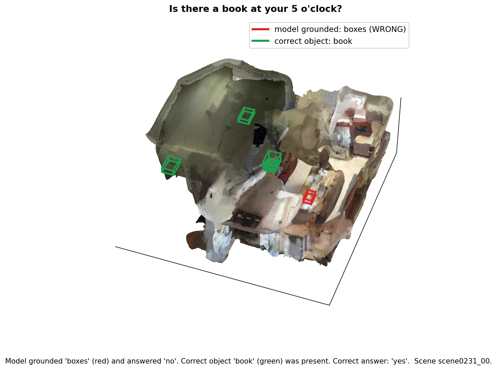
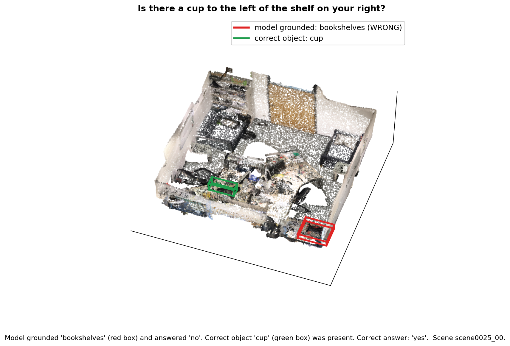
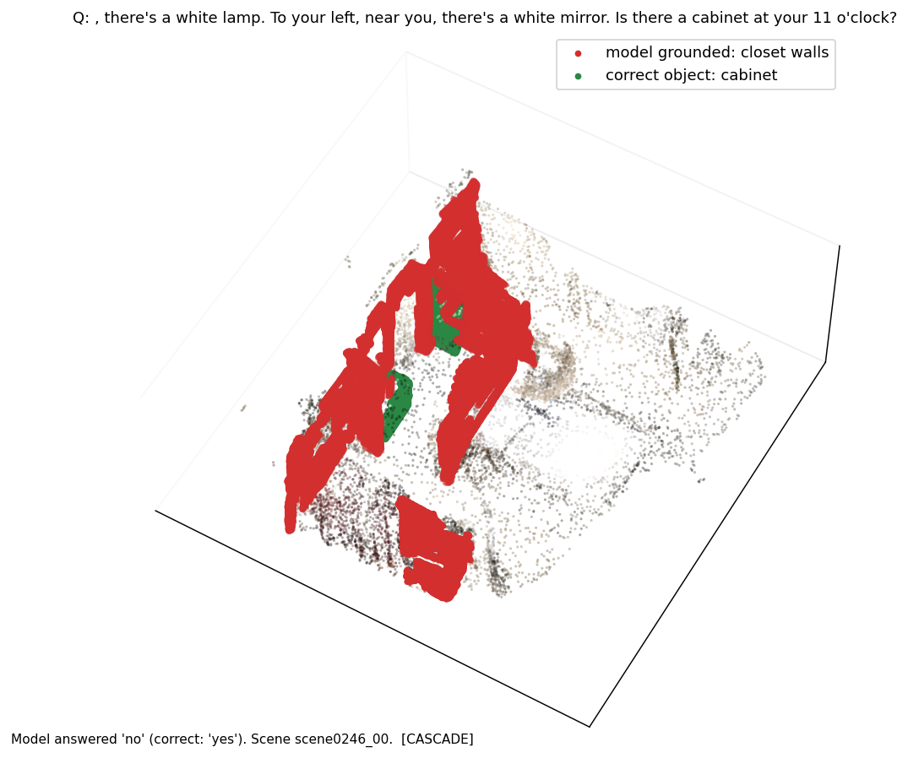
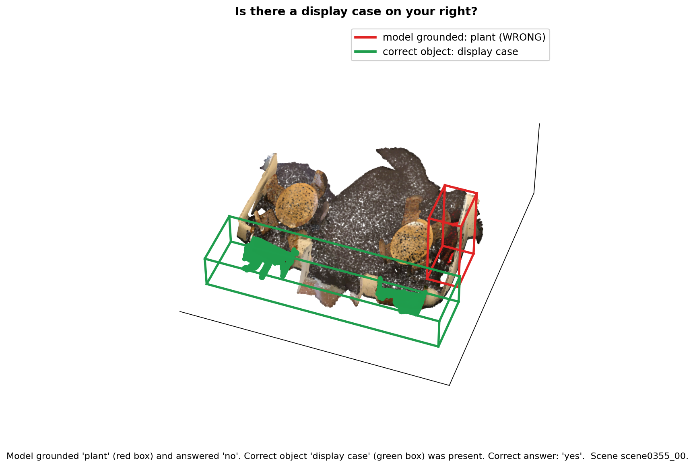
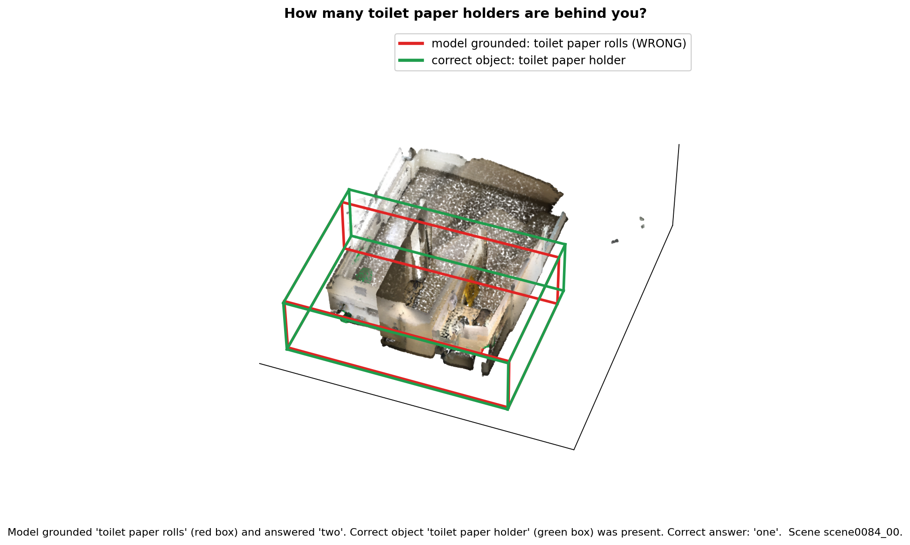
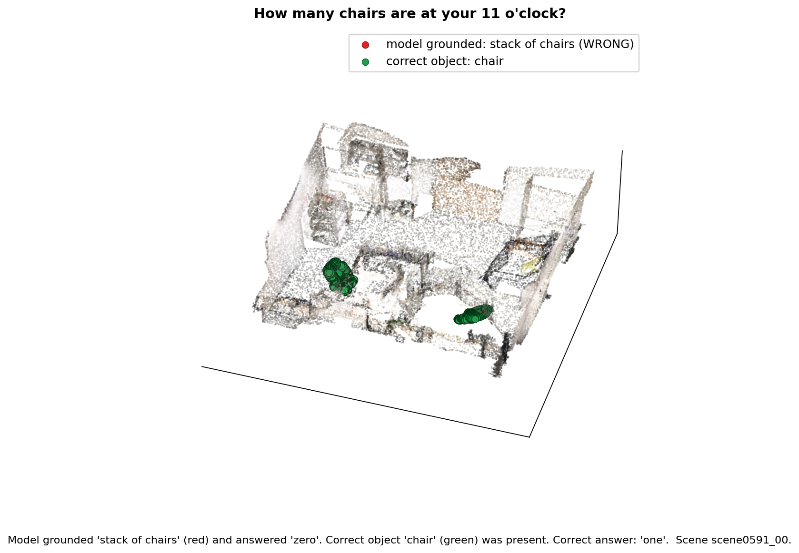

# EE243 Final Project: A Structural Limitation in SceneCOT's Grounded Reasoning

**Course:** EE 243 Advanced Computer Vision, Spring 2026, UC Riverside
**Team:** Nishant Tiwari, Simarpal Singh

**Paper studied:** SceneCOT: Eliciting Grounded Chain-of-Thought Reasoning in 3D Scenes (ICLR 2026)

Project webpage: https://nishanttiwari00786.github.io/scenecot-grounding-cascade/

Video walkthrough: https://www.youtube.com/watch?v=GQELvez59c0

---

## Summary

SceneCOT answers questions about 3D rooms by reasoning in four fixed steps, and a
middle step called grounding is supposed to point to the specific object the
question is about. We first reproduce SceneCOT's evaluation, then we expose a
**structural limitation**: the four steps run in a strict sequence with no way to
check or correct the grounding step, so any grounding error is final and flows
straight into the answer. We show that on the two most grounding dependent
question types, the large majority of wrong answers come from this exact failure,
and separately that a large share of the model's correct answers are produced
without correct grounding, which means its accuracy overstates how much it
actually understands the scene.

The experimentation is about the **design**: SceneCOT commits to a single
grounding result at inference with no recovery mechanism, and we demonstrate
empirically that this design choice is where its failures concentrate.

We also identify a **second bottleneck** at a different stage of the pipeline
(Part 3, spatial representation). Even when the model grounds the right objects,
spatial relationship questions fail at a much higher rate than existence
questions (21.1 percent on the full MSQA test set). We traced this to how
SceneCOT passes spatial information to the language model: object coordinates are
rounded to a ten centimeter grid before the model reads them, which destroys the
fine geometry needed to answer questions like "in front of" or "within the area
of." On a harder stress test slice filtered for explicit directional language,
spatial relationship accuracy drops further to 16.7 percent, confirming that the
limitation concentrates on the questions that demand the finest geometry.

The course asked for depth over breadth, so we focused on these two bottlenecks
and studied each carefully with both quantitative and qualitative evidence.

---

## Table of contents

1. [How SceneCOT works, and how grounding works inside it](#how-scenecot-works-and-how-grounding-works-inside-it)
2. [Research lineage](#research-lineage)
3. [The limitation we target, stated precisely](#the-limitation-we-target-stated-precisely)
4. [Datasets: what SceneCOT trains on and what we test on](#datasets-what-scenecot-trains-on-and-what-we-test-on)
5. [Part 1: Reproducing the baseline](#part-1-reproducing-the-baseline)
6. [Part 2: How we got from the baseline to our experiment](#part-2-how-we-got-from-the-baseline-to-our-experiment)
7. [Method: exactly what we measured and discussion on code](#method-exactly-what-we-measured)
8. [Quantitative Results](#results)
9. [Qualitative results: seeing the visual examples](#qualitative-results-seeing-the-grounding-error)
10. [Success cases](#success-cases)
11. [Limitations of our analysis](#limitations-of-our-analysis)
12. [Part 3: Spatial reasoning experiment](#part-3-spatial-reasoning-experiment-option-a)
13. [How to reproduce](#how-to-reproduce)
14. [Repository structure](#repository-structure)
15. [Acknowledgements](#acknowledgements)

---

## How SceneCOT works, and how grounding works inside it

To explain the limitation, we first have to be precise about how SceneCOT
produces an answer, and especially how its grounding step actually works.

SceneCOT is built on the LLaVA-1.5 vision language model (Vicuna-7B backbone, LoRA
fine tuned). For every question it runs four steps in a fixed order, and each step
consumes the output of the previous one:

1. **Task recognition.** The model emits a `<think_type>` token deciding the
   question category (counting, existence, spatial, navigation, and so on). This
   choice controls which coordinate representation the later steps use.

2. **Region localization.** A rule based symbolic engine uses the agent's position
   and orientation to restrict the scene to the relevant sub region, expressed as
   cardinal directions (left, right) or clock directions (3 o'clock). This narrows
   the set of candidate objects before any neural grounding happens.

3. **Entity grounding.** This is the step our project is about, so here is the
   mechanism in detail:
   - First, an off the shelf 3D instance segmenter, **Mask3D**, has already broken
     the room into a fixed set of candidate object proposals (one mask per detected
     object). In the released data these predicted instances are the `pred` point
    clouds the eval loads `(data.cotqa.msr3d.pc_type=pred)`.
   - The grounding module, which is based on **PQ3D**, then scores each of those
     proposals for how well it matches the question, and emits an object
     probability list. In the saved reasoning chain this appears as a section
     called `<obj_prob>`, for example: `book 0.75 boxes 0.64 desk 0.63`.
   - The objects with high probability are taken as "the objects the model
     grounded."

4. **Grounded reasoning.** The symbolic engine turns the grounded objects into a
   visual clue (for counting and existence, the set of grounded objects; for
   spatial, their coordinates), and the language model produces the final answer
   **only from that clue**.

A deliberate design choice is the hybrid neural plus symbolic split: the geometry
math (clock directions, distances) is computed by fixed rules, not learned, so the
spatial math is exact. The strength the paper emphasizes is **grounding QA
coherence**, a metric that rewards the model for getting the grounding and the
answer correct together, where SceneCOT scores well above prior models.

**The single fact that drives our whole project:** the four steps are sequential,
and step 4 can only ever see the objects step 3 grounded. There is no step that
re-examines or corrects grounding. This is what makes a grounding error
unrecoverable, which we develop in the section below.

---

## Research lineage

SceneCOT builds on four earlier lines of work. Each solved part of the problem and
left something open.

| Paper | What it contributed | What it left open |
|-------|--------------------|-------------------|
| Chain-of-Thought Prompting (Wei et al. 2022) | Reasoning step by step before answering greatly improves accuracy on hard problems | Works only on text, with no understanding of 3D space or images |
| PQ3D (2024) | A single architecture that handles different 3D inputs and answers prompts from a shared 3D representation; SceneCOT reuses it as the grounding module | Answers in one pass, so it cannot break a question into multiple reasoning steps |
| Chat-Scene (NeurIPS 2024) | Turns a scene into discrete object tokens an LLM can read, giving strong object referencing; introduced the detector-proposal style grounding SceneCOT also relies on | Depends on the object detector being correct, with no way to recover if it is wrong |
| LEO (ICML 2024) | An embodied agent combining perception, reasoning, and action in one model | Built for general action, so it is weak on deep step by step spatial reasoning |

The common gap is that none combine step by step reasoning with explicit object
grounding. SceneCOT fills it. But note the inherited weakness from PQ3D and
Chat-Scene: SceneCOT's grounding is only as good as the Mask3D proposals and the
PQ3D scoring, and like its predecessors it has no mechanism to recover when that
grounding is wrong. Our experiment measures the consequence of that inherited
weakness inside SceneCOT's sequential design.

---

## The limitation we target, stated precisely

SceneCOT's reasoning chain is sequential and committed. At inference time:

- The grounding module produces one object probability list and the pipeline
  proceeds with it.
- There is **no ground truth available at inference**. The model cannot check its
  own grounding against a correct answer, because at runtime there is no correct
  answer to check against. It has only its own scores.
- There is **no later step that revisits grounding**. Step 4 reasons over whatever
  step 3 produced and emits an answer.

Put together, this means a grounding error in step 3 is **structurally
unrecoverable**: the model has no signal that it grounded the wrong object and no
stage in which it could correct course. The wrong object propagates into the
answer. We call this propagation a **grounding cascade**.

This is the precise sense in which it is a limitation of the architecture, not
just model imperfection. A different design (for example, one that grounds several
candidates and reasons over alternatives, or that produces a confidence flag and
re-grounds when confidence is low) could in principle recover. SceneCOT's
straight-through sequential design cannot. Our experiment quantifies how much of
SceneCOT's behavior this actually explains.

We also examine the reverse direction. SceneCOT's headline strength is grounding QA
coherence, the agreement between grounding and answer. We do **not** claim to
measure that metric. Instead we measure a related but distinct thing: the fraction
of **correct answers that were produced without correct grounding**. When that
fraction is large, it means raw answer accuracy is an inflated picture of how much
the model truly grounds its answers in the scene. This is a statement about the
gap between accuracy and grounding, which is different from the coherence metric
the paper reports.

---

## Datasets: what SceneCOT trains on and what we test on

Because the architecture and the data matter together, here is the full dataset
picture.

**What SceneCOT was trained on: SceneCOT-185K.** The authors assembled a training
set of about 185,000 examples, each carrying a full step by step reasoning chain
(this reasoning annotation is the genuinely new part). It has two sources:

| Portion | Size | Origin | What it constitutes |
|---------|------|--------|---------------------|
| MSQA | 145.6K | An existing situated reasoning benchmark, built on ScanNet indoor scans | Questions that place an agent at a position and orientation in a real scanned room and ask about nearby objects (counting, existence, spatial, navigation, and more) |
| GQA3D | 40K | Created by the authors using GPT-4o | Object centric question answer pairs auto generated from object images, used to strengthen object level grounding |

The underlying 3D scenes come from **ScanNet**, a large public collection of real
indoor room scans (offices, bathrooms, kitchens). The authors did not collect new
scenes; they reused ScanNet and added reasoning chains and the GQA3D questions.

The data we actually evaluate on: The MSQA test splt: The MSQA annotations ar bundled inside SceneCOT's released data, 
in `data_assets/scenecot_cot_data/MSQA`. We did not download MSQA separateky or built it overselves. 
It is shipped with SceneCOT data release, and the evaluation script point at it through the environment variable 
`SCENECOT_MSR3D_ANNO_DIR`

MSQA (Multi-moddal Situated Question Answering) places an agent at a specific position and orientation inside a real ScanNet room, and asks 
a question about the surrounding objects. Each entry records  the scene id, the agent position and orientation, the question type, 
and ground truth reasoning chain (which includes the object that should be grounded). The MSQA test split spans nine question types but we used 
counting and existence

| Type | Count | Why we chose it |
|------|-------|-----------------|
| Counting | 133 | Requires finding and enumerating the right objects, so grounding directly determines the count |
| Existence | 96 | Requires finding the object to say whether it is present |

Together that is 229 questions. Of these, 190 were **evaluable** (132 counting, 58
existence); the rest were skipped because their ground truth reasoning chain had no
grounded object to compare against. We deliberately left out types like spatial and
navigation here, because those mix in coordinate to language conversion that would
blur a clean test of grounding. (Spatial is studied separately in Part 3.)

**Important note on ground truth grounding.** The "objects that should have been
grounded" come from the ground truth reasoning chains in the released data. We use
these only as an **after the fact measuring stick** to judge the model's grounding.
They are not available to the model at inference; the model never sees them. This
is exactly why the limitation is structural, as explained above.

---

## Part 1: Reproducing the baseline

Before any experiment we reproduced the authors' evaluation to get a trusted
starting point.

**What the run does.** We ran SceneCOT's full grounded question answering
evaluation on an NVIDIA RTX A6000 GPU. The run loaded the LLaVA backbone, the PQ3D
grounding module, and the trained SceneCOT weights, then answered every test
question and scored itself. It took about three hours and forty seven minutes. The
full console log is in `eval_output_107559.txt`; a short summary is in
`BASELINE_RESULTS.md`.

**What it produced.** For every test question the model saved the question, the
correct answer, and its own complete reasoning chain, including the `<obj_prob>`
grounding section and the final answer. These predictions are in
`experiments/SceneCOT_msqa_beacon3d_test_moe/eval_results/`, with the MSQA file at
`QACOTScanNetMSR3D/results.json` (826 questions) and the GQA3D file at
`QACOTScanNetGQA3D/results.json`.

**Baseline scores we obtained**, confirming the setup works:

| Metric | Score |
|--------|------:|
| Overall (em_refined) | 52.1% |
| Existence | 65.4% |
| Spatial | 51.3% |
| Appearance | 47.1% |

Term notes: **GQA3D / Grounded QA** is the Beacon3D style benchmark where the model
must ground and answer correctly together. **em_refined** is refined exact match,
which compares the predicted and correct answer after light text cleanup so minor
formatting differences are not penalized. The rows below Overall are the same
metric restricted to one question type.

---

## Part 2: How we got from the baseline to our experiment

The baseline gives accuracy numbers but does not explain **why** the model is
wrong. The key realization is that the saved reasoning chains already contain the
grounding step's `<obj_prob>` list, so we can see exactly which objects the model
chose before answering, and compare them to the objects it should have chosen.

That means we can run the entire analysis on the saved predictions, with no GPU and
no model rerun. The baseline tells us how often the model is right; our analysis
opens up each chain and tells us where the failures originate. This is the
diagnostic layer the standard evaluation does not provide.

Concretely, our two questions are:

1. When the model gives a **wrong** answer, did the failure originate in grounding
   (wrong object chosen) or in reasoning (right object chosen, but the final step
   still wrong)?
2. When the model gives a **right** answer, was it actually grounded in the correct
   object, or did the model reach the right answer without correct grounding?

The first question tests whether the cascade is the dominant failure mode. The
second tests whether the model's accuracy is genuinely grounded.

---

## Method: the grounding cascade analysis code

Our analysis is implemented in `grounding_cascade_analysis.py`. Here is exactly what it
does, step by step, so the numbers below are fully reproducible.


1. Parse the grounding list. For each question, the code reads the model's saved
reasoning chain and pulls out the `<obj_prob>` section, turning text like
book 0.75 boxes 0.64 desk 0.63 into a list of (object, confidence) pairs. We filter
out non-object words (a small stopword list like "the", "object", "probability") so
they are never mistaken for grounded objects.

2. Decide what was grounded. An object counts as "grounded" only if its confidence
is at least 0.5. We do the same parsing on the ground truth chain to get the objects
that should have been grounded.

3. Decide if grounding was correct. We use a deliberately lenient rule: grounding
counts as correct if the model grounded at least one of the correct object types (a set
intersection between the model's grounded labels and the ground truth labels). A
stricter rule would only make grounding look worse, so this keeps our cascade numbers
conservative. The label match is text based, which we list as a limitation later.

4. Decide if the answer was correct. We pull the final answer out of both chains and
normalize the text (stripping stray unicode characters that appear in the saved ground
truth answers) so that, for example, a noisy version of "four" compares equal to "four".

5. Cross-tabulate. Each question is sorted by two yes/no facts (grounding correct,
answer correct) into one of four groups:


| | Answer right | Answer wrong |
|---|---|---|
| **Grounding right** | Correct (pipeline worked) | Reasoning failure (grounding fine, reasoning slipped) |
| **Grounding wrong** | Correct answer without correct grounding | Cascade (wrong object caused wrong answer) |

The script that does this is `grounding_cascade_analysis.py`. It is fully commented
and reproducible.

---

## Quantitative Results


| Category | Counting (n=132) | Existence (n=58) |
|----------|-----------------:|-----------------:|
| Right grounding, right answer | 8 (6.1%) | 19 (32.8%) |
| Wrong grounding, wrong answer (cascade) | 61 (46.2%) | 15 (25.9%) |
| Wrong grounding, right answer | 48 (36.4%) | 24 (41.4%) |
| Right grounding, wrong answer (reasoning) | 15 (11.4%) | 0 (0.0%) |

Our analysis covers the counting and existence questions from the 826 MSQA test questions: 133 counting and 96 existence, which is 229 of the 826. Of those, 190 were evaluable (132 counting and 58 existence), after dropping questions whose ground truth chain had no grounded object to compare against. Those 190 are what the table below is built from.

Finding 1: failures concentrate in grounding, and the sequential design makes them final. Of all the wrong answers, 83.5 percent trace back to the model grounding the wrong object (80.3 percent for counting, 100 percent for existence). To be clear about how that is computed, a wrong answer is either a cascade (wrong grounding) or a reasoning failure (right grounding but wrong answer anyway), and the percentage is cascades divided by all wrong answers. For existence, all 15 wrong answers were cascades and none were reasoning failures, so it is 100 percent. For counting, 61 of the 76 wrong answers were cascades, so 80.3 percent. Reasoning failures are rare in both. Because the pipeline never revisits grounding, these grounding errors cannot be corrected and propagate straight to the answer. This is the cascade, and it is the dominant failure mode, which is the structural limitation we set out to demonstrate.

One detail worth reading off the table: on counting, the "right grounding, right answer" group is tiny, only 8 of 132. That is partly because grounding on counting is genuinely hard, so the model rarely grounds every correct object, and partly because counting is hard even when the grounding is right. The reasoning failure row, 15 of 132, shows that second effect directly: even with correct grounding, the final count is sometimes still wrong.

Finding 2: a large share of correct answers are not actually grounded, so accuracy overstates real understanding. On counting, 36.4 percent of answers were correct even though the model grounded the wrong object. Counting has many possible answers, so this is not the kind of coincidence a yes/no guess could produce. The model is often landing on the right number while looking at the wrong objects. We are careful with the wording here: this is not a claim about the paper's coherence metric. It is a measurement of the gap between answer accuracy and correct grounding, and it shows that raw accuracy gives an inflated picture of how grounded the model's answers really are.

To keep the two wrong-grounding groups separate: a cascade is a chain reaction, where the wrong grounded object goes into the answering step and the answer comes out wrong, so the grounding error caused the answer error. A correct answer without correct grounding is the opposite surprise, where the model also grounded the wrong object but the answer happened to be right anyway, so the correctness is not explained by grounding.

---

## Qualitative results: seeing the grounding error

To make the cascade visible, we render the actual ScanNet room for cascade examples and
draw a red 3D box around the object the model wrongly grounded and a green 3D box around
the correct object. If the grounding error is real, the red box sits on the wrong object
while the green box sits on the object the question was actually about.

A note on the renders, and why they are not as clean as the paper's figures

The SceneCOT paper shows smooth, textured 3D rooms. We could not reproduce that exact
look, because `(SceneVerse/ScanNet/scan_data/pcd_with_global_alignment)` contains point clouds
only: for each scene we get the XYZ coordinates, the RGB color, and a per-point
instance id, but no surface mesh (no faces or triangles). The paper's smooth figures
use the original ScanNet textured meshes, which are not part of this release.

Getting those original meshes is not a quick step. The full ScanNet dataset is gated
behind a signed terms-of-use agreement, the download is on the order of a terabyte, and
it would then need its own processing pipeline to align and render. That is well outside
the scope and time of this project. So instead of downloading ScanNet, we wrote our own
rendering code
`(make_scene_renders.py)` that:

1. loads the point cloud and the instance-to-label dictionary for a scene,
2. runs Poisson surface reconstruction (via Open3D) to turn the raw points into a
continuous surface, which is what gives our renders their solid look.
3. finds the instance ids whose label matches the grounded object and the correct
object, and draws a tight 3D bounding box around each instance.
4. renders the result from an angled top-down view.

The result is recognizably a real room with the two objects boxed, which is enough to
see the grounding error. But because we reconstruct the surface from points rather than
using a real mesh, the surfaces are bumpy in places and some boxes are loose. 

Figure 1: "Is there a book at your 5 o'clock?" The model grounded boxes instead of book and
answered no, when the correct answer was yes. The green boxes sit on the actual books;
the red box sits on the wrong object




Figure 2: "Is there a cup to the left of the shelf on your right?" The model grounded bookshelves
instead of cup and answered no, when the answer was yes. The wrong object (red) and the
real cup (green) are in clearly different parts of the room.



Figure 3: "Is there a display case on your right?" The model grounded plant instead of
display case and answered no, when the answer was yes.




Figure 4: "How many chairs are in the middle distance behind you?" The model grounded armchair
instead of chair, so it counted the wrong set of objects.




Figure 5: A second view of the same merged-chairs failure mode, where the grounded object does not
line up with the individual chairs the question asks about.




Figure 6: "How many chairs are at your 11 o'clock?" This is the clearest counting cascade: the
grounding step returned a single merged proposal labeled stack of chairs rather than
separate chairs, so the model could not count the individual chairs correctly. The green
boxes show the real chairs the question is about.




---

## Success cases

When grounding succeeds, the pipeline behaves as designed and the answer is tied to
the correct object.

| Question | What the model grounded | Answer |
|----------|------------------------|--------|
| Is there a copier in the room? | copier | yes (correct) |
| Is there a whiteboard at your 5 o'clock? | whiteboard | yes (correct) |
| Is there a backpack on the table? | backpack | yes (correct) |

These show the intended behavior: the model finds the exact object the question
asks about and answers from it. They also confirm our analysis is not simply
labeling everything a failure; when grounding is right, the pipeline works.

---

## Limitations of our analysis

We are explicit about where our method could be improved.

First, our grounding-correct rule is a label-overlap heuristic. We match object
labels as text, so a singular/plural or synonym mismatch (for example "pictures"
versus "picture") can be counted as a grounding miss. This means our cascade
percentage may be slightly overestimated, although the effect is far too large to
be explained by label noise.

Second, existence questions are yes/no, so a wrong guess still matches the correct
answer half the time by chance. We avoid leaning on this by reporting counting
separately, where the larger answer space removes the coincidence, and we treat the
counting numbers as our strongest evidence.

Third, our result is a strong correlation backed by the known sequential design, not
a controlled intervention. The natural stronger test is to substitute oracle
grounding (force the correct object) and measure how much the answers improve. The
paper's own oracle style experiments point the same direction, and we note this as
the clear next step.

Fourth, on the qualitative side, our scene renders are reconstructed from point clouds
rather than drawn from the original ScanNet meshes, so they are visually imperfect and the
bounding boxes are approximate. They are meant as supporting evidence that the grounded
object and the correct object occupy different places in the room, not as exact
segmentations.

---

## Part 3: Spatial reasoning experiment (Option A)

This part studies how SceneCOT handles spatial relationship questions and is led by
Simarpal Singh.

**From baseline to experiment.** The baseline GQA3D table in Part 1 reports
51.3 percent on spatial questions using the refined exact match metric. When we
looked inside the MSQA predictions at the question type level using strict exact
match, spatial relationship was one of the worst categories at 21.1 percent
(40 correct out of 190), while existence reached 82.3 percent (79 out of 96).
That gap suggested the problem is not uniform across question types. Spatial
relationship questions require precise relative geometry between objects, so we
asked whether the model is failing because it picks the wrong objects, or
because the spatial information it receives is too coarse to reason from.

**The limitation we are testing.** SceneCOT does not pass raw 3D coordinates
directly to the language model. After the grounding module detects objects, the
model injects their locations as text inside a chain of thought tag called
obj_loc_prob. Each object is written as a comma separated string of egocentric
x, y, z coordinates plus size, for example microwave: -3.0,-0.7,1.4,0.7,0.2,0.5.
The language model then reads these strings and reasons about spatial
relationships from them. Our claim is that this representation has a built in
floor: coordinates are formatted with one decimal place, which snaps every axis
to a ten centimeter grid. Relations that depend on finer offsets, such as
whether a cup is on a table or whether a lamp is in front of versus above a
chair, become ambiguous or wrong before the language model ever reasons about
them.

**Why this happens (mechanism).** In scenecot/model/scenecot_agent.py, the
function build_obj_prob_loc_txt converts each object's 3D center into the
agent's egocentric frame using a rotation matrix, then formats the result with
f"{coord:.1f}" on every axis. This is a deterministic input side operation, not
a learned failure. We replicated this path in test_rotation_resolution.py using
only the Python standard library. The simulation shows three concrete failure
modes:

- **Quantization collapse.** Two objects five to seven centimeters apart can
  serialize to identical coordinate strings, so the language model has zero
  signal that they occupy different positions.
- **Sign flips at the midline.** An object four centimeters to the agent's left
  can print as 0.0 while one eight centimeters to the right prints as -0.1,
  inverting the apparent left right relation.
- **Orientation dependent nondeterminism.** The same physical pair of objects
  can collapse at some viewing angles and survive at others, because rotation
  happens before rounding. The relation the model sees depends on camera pose
  even when the scene is static.

Full simulation output is saved in results/rotation_resolution_output.txt.

**How we measured it.** We used three tools that build on each other:

1. **diagnose_spatial.py** parses the baseline evaluation log
   (eval_output_107559.txt) and extracts failed spatial relationship questions
   with their full de tokenized chain of thought, including the obj_loc_prob
   block the model actually reasoned from. Output is in
   results/spatial_failures.txt.
2. **test_rotation_resolution.py** isolates the coordinate serialization math
   without running the model, to show why truncation causes the failures we see
   in the log.
3. **generate_spatial_test_slice.py** and **run_eval_spatial.sh** build and
   evaluate a harder subset of MSQA test questions. The slice keeps questions
   with explicit directional language (behind, underneath, closest to, and
   similar) or multi object relative tracking phrasing. This tests whether the
   limitation concentrates on the hardest spatial questions.

**Results.**

*Baseline MSQA breakdown (strict exact match, from eval_output_107559.txt):*

| QA type | Correct | Total | EM |
|---------|--------:|------:|---:|
| existence | 79 | 96 | 82.3% |
| spatial relationship | 40 | 190 | 21.1% |
| navigation | 21 | 144 | 14.6% |
| counting | 56 | 133 | 42.1% |

Spatial relationship sits near the bottom. Of 190 spatial relationship questions,
150 failed (79 percent failure rate).

*Spatial stress test slice (filter only, from generate_spatial_test_slice.py):*

| Filter criterion | Questions kept |
|------------------|---------------:|
| Directional tokens (behind, underneath, directly above, closest to, furthest) | 60 |
| Multi object relative tracking | 56 |
| **Total kept (union)** | **114 / 826 (13.8%)** |

| Type in stress slice | Count |
|----------------------|------:|
| spatial relationship | 42 |
| navigation | 39 |
| counting | 24 |
| other | 9 |

*Stress slice evaluation (SLURM job 107623, eval_spatial_output_107623.txt):*

We re ran the model on the 114 question slice using run_eval_spatial.sh. The MSQA
predictions are in
experiments/SceneCOT_msqa_beacon3d_test_moe/eval_results/QACOTScanNetMSR3D/results_stress_slice.json
(114 entries). The eval script also runs the full GQA3D split afterward, which is
why the log still shows 596 total batches even though MSQA results contain only
114 questions.

| QA type | Correct | Total | EM (stress slice) | EM (full MSQA baseline) |
|---------|--------:|------:|------------------:|------------------------:|
| spatial relationship | 7 | 42 | **16.7%** | 21.1% |
| navigation | 7 | 39 | 17.9% | 14.6% |
| counting | 9 | 24 | 37.5% | 42.1% |

**Finding 1: spatial relationship is among the worst categories on the full test
set.** At 21.1 percent exact match (40 of 190), it sits near the bottom alongside
navigation (14.6 percent), while existence reaches 82.3 percent. One hundred fifty
spatial relationship questions failed.

**Finding 2: the limitation concentrates on hard spatial questions.** On the
stress slice, spatial relationship accuracy drops to 16.7 percent (7 of 42),
below the full set baseline of 21.1 percent. The filter deliberately kept
questions with explicit directional tokens ("behind", "closest to", and similar)
or multi object relative tracking phrasing, the cases where fine grained geometry
matters most. The model performs worse on exactly the subset where truncation
should hurt most.

**Finding 3: spatial failures trace to coarse grounding text, not just wrong
objects.** In the qualitative failures below, the model often grounds the
correct object types with high confidence, but the obj_loc_prob strings use
coordinates rounded to ten centimeters. The model then asserts a plausible but
wrong relation, such as "supported by" instead of "within the area of" or
"above" instead of "in front of." This is a different failure mode from Option
B's cascade, where the wrong object is selected entirely. Here the objects are
often right, but the spatial representation passed to the language model cannot
encode the relation the benchmark asks for.

**Failure cases (qualitative).**

| Scene | Question (short) | Ground truth | Predicted | What the model saw in obj_loc_prob |
|-------|-----------------|--------------|-----------|-------------------------------------|
| scene0231_00 | Relation between kitchen cabinet and microwave at 6 o'clock | microwave is within the area of the cabinet | microwave is supported by the cabinet | microwave: -3.0,-0.7,1.4 vs cabinet: -3.2,-0.7,1.8. Close coords after rounding; "within" vs "on" is underspecified. |
| scene0231_00 | Where is the lamp relative to the armchair? | lamp is in front of the armchair | lamp is above the armchair | lamp z=1.6, armchair z=0.7. Vertical offset is preserved but horizontal front/back distinction depends on fine offsets the string does not reliably encode. |
| scene0458_00 | Relationship between bottle and soap dish | bottle is lower than soap dish, within shower area | bottle is supported by the soap dish | Both objects detected; relation confused between vertical ordering and support/contact. |

Twenty annotated baseline failures with full chain of thought are in
results/spatial_failures.txt (from eval_output_107559.txt). Twenty failures
from the stress slice run are in results/spatial_failures_stress_slice.txt
(from eval_spatial_output_107623.txt).

**Limitations of this analysis (Option A).**

First, the baseline GQA3D spatial score (51.3 percent, em_refined) and our MSQA
spatial relationship score (21.1 percent, strict exact match) use different
benchmarks and scoring rules. We report both but do not directly compare them as
the same number.

Second, our mechanism analysis identifies the truncation in build_obj_prob_loc_txt
and shows it causes failures in simulation and in real log examples, but we have
not run a controlled ablation that changes the formatting to two decimal places
and remeasures accuracy. That would be the strongest confirmation.

Third, the stress slice is a heuristic filter (directional keywords plus multi
object relative phrasing), not an oracle difficulty label. It also mixes in
navigation and counting questions that share directional language but may fail
for other reasons. We report spatial relationship separately within the slice
for this reason.

---


## How to reproduce

The analysis runs on the saved predictions, so no GPU or model rerun is needed
for Option B. Option A's simulation and log parsing also run locally; the stress
slice eval requires the cluster.

### Option B: grounding cascade

Combined analysis on counting and existence:

```bash
python grounding_cascade_analysis.py \
  --results experiments/SceneCOT_msqa_beacon3d_test_moe/eval_results/QACOTScanNetMSR3D/results.json
```

Each type separately, which is what the results table reports:

```bash
python grounding_cascade_analysis.py --results PATH_TO_RESULTS.json --types counting --examples 3
python grounding_cascade_analysis.py --results PATH_TO_RESULTS.json --types existence --examples 3
```

Build the results chart:

```bash
python make_cascade_chart.py
```

Build the qualitative image cards (uses the ScanNet object images):

```bash
python make_qualitative_cards.py \
  --results experiments/SceneCOT_msqa_beacon3d_test_moe/eval_results/QACOTScanNetMSR3D/results.json \
  --img_dir data_assets/scenecot_imgs/imgs/scannet \
  --out qualitative_cards --n 10
```

### Option A: spatial reasoning

Run the coordinate truncation simulation (no model, no GPU):

```bash
python3 test_rotation_resolution.py > results/rotation_resolution_output.txt
```

Parse the baseline eval log for spatial relationship failures:

```bash
python3 diagnose_spatial.py eval_output_107559.txt \
  --results-json experiments/SceneCOT_msqa_beacon3d_test_moe/eval_results/QACOTScanNetMSR3D/results.json \
  --top 20 > results/spatial_failures.txt
```

Parse the stress slice eval log (after run_eval_spatial.sh completes):

```bash
python3 diagnose_spatial.py eval_spatial_output_107623.txt \
  --results-json experiments/SceneCOT_msqa_beacon3d_test_moe/eval_results/QACOTScanNetMSR3D/results_stress_slice.json \
  --top 20 > results/spatial_failures_stress_slice.txt
```

Generate the spatial stress test slice from the MSQA test annotations:

```bash
python3 generate_spatial_test_slice.py \
  --input data_assets/scenecot_cot_data/MSQA/situated_qa_test_pure_txt.json \
  --output data/msqa_spatial_stress_test.json
```

To evaluate on the slice from scratch (requires GPU, model weights, and data
assets on the cluster), point the annotation directory at the slice and submit:

```bash
# After symlinking situated_qa_test_pure_txt.json to the slice inside
# data_assets/msqa_spatial_slice/ (see run_eval_spatial.sh)
sbatch run_eval_spatial.sh
```

### Baseline evaluation from scratch

To reproduce the baseline predictions from scratch, `run_eval.sh` runs the full
SceneCOT evaluation on one GPU and writes the prediction files used above.

---

## Repository structure

```text
EE243_Scenecot_Project/
├── scenecot/                           # Original SceneCOT codebase (git submodule)
├── experiments/
│   └── SceneCOT_msqa_beacon3d_test_moe/
│       └── eval_results/
│           ├── QACOTScanNetMSR3D/
│           │   ├── results.json              # MSQA baseline predictions, 826 questions
│           │   └── results_stress_slice.json # MSQA stress slice predictions, 114 questions
│           └── QACOTScanNetGQA3D/
│               └── results.json              # GQA3D and Beacon3D predictions
├── data/
│   └── msqa_spatial_stress_test.json         # 114 question spatial stress slice (generated)
├── results/
│   ├── spatial_failures.txt                  # Option A, baseline failure diagnosis
│   ├── spatial_failures_stress_slice.txt     # Option A, stress slice failure diagnosis
│   └── rotation_resolution_output.txt        # Option A, truncation simulation output
├── scene_renders/                      # Option B, 3D render figures
├── qualitative_cards/                  # Option B, side by side image cards
├── grounding_cascade_analysis.py       # Option B analysis script
├── make_cascade_chart.py               # Option B results chart
├── make_qualitative_cards.py           # Option B qualitative image cards
├── diagnose_spatial.py                 # Option A, spatial failure parsing
├── generate_spatial_test_slice.py      # Option A, spatial stress test slice
├── test_rotation_resolution.py         # Option A, coordinate truncation simulation
├── run_eval.sh                         # Batch script for baseline evaluation
├── run_eval_spatial.sh                       # Batch script for spatial slice evaluation
├── eval_output_107559.txt                    # Full baseline evaluation log
├── eval_spatial_output_107623.txt            # Stress slice evaluation log (job 107623)
├── cascade_analysis_output.txt               # Option B analysis output
└── BASELINE_RESULTS.md                 # Baseline numbers summary
```

---

## Acknowledgements

We thank the authors of SceneCOT for releasing their code, weights, and data, and
the EE 243 course staff and the UCR CSE HPC cluster for the compute used in this
project. This is a course project for analysis and educational purposes, and all
rights to the original SceneCOT work belong to its authors.
